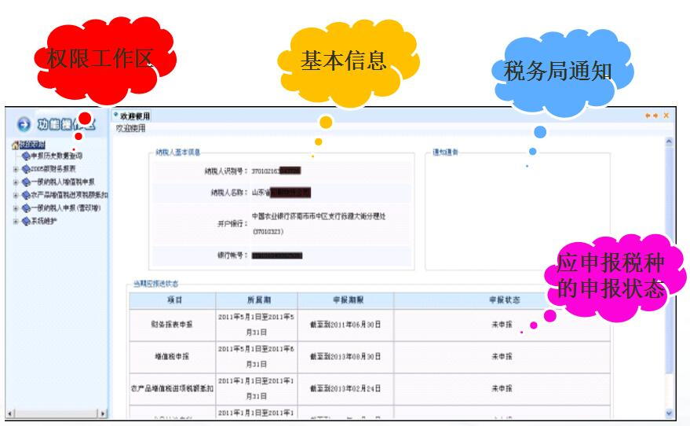
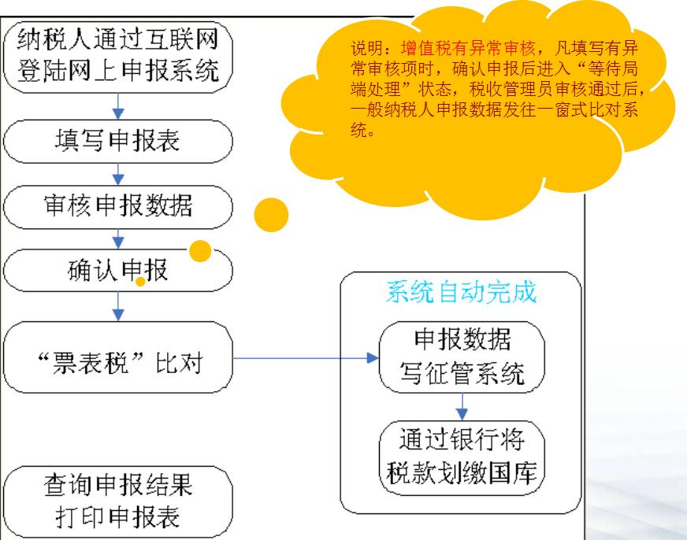

#网上办税平台一本通
##（一般纳税人版）

##一、系统登录

用户点击山东省国家税务局门户网站左侧---办税服务下的“山东省国家税务局网上办税平台”，登录本系统。

联通用户请访问：http://218.57.142.38:8080/

电信用户请访问：http://58.56.112.141:8080/

首次登录系统时需先在www.96005656.com进行注册并设置登录密码（初始密码为6个6或者8个8或者缴款银行账号后六位）。

     全省统一服务热线96005656

##二、申报流程

   一般纳税人增值税申报业务流程图

    到主管税务机关签订银税协议后可通过电子申报系统自动扣款。

电子申报接收时间说明：

  增值税、消费税电子申报时间截止到当月申报期的最后一天晚23时。

  电子申报划款时间截止到最后一天的中午12时。在此时间之后查询到的划款情况即为当期申报划款的最终状态。

  申报期最后一天下午，电子申报扣款失败的用户或刚申报成功的用户请到当地申报大厅手工交款，为避免重复扣款，电子申报系统不再执行自动扣款。

##三、报表填写

1、申报财务报表。

2、按顺序填写增值税申报表。
以下六张表为必报表：

增值税纳税申报表附列资料（三）(本表由营业税改征增值税应税服务有扣除项目的纳税人填写。其他纳税人不填写。)

增值税纳税申报表附列资料（一）

固定资产进项税额抵扣情况表

增值税纳税申报表附列资料（二）

增值税纳税人申报表（适用于增值税一般纳税人）

增值税补充申报表

以下三张表用户可根据实际经营情况选择填报：

《增值税纳税申报表附列资料（四）》（税收抵减情况表）

运输发票

成品油购销存情况明细表

     注意事项：

    1、表内浅色单元格为可填写项，深色单元格不可操作，其数据来源为：国税征管中获取的基础数据/附表中有表间关系的项目/本项目有计算公式，软件自动计算。

    2、输入数字时，需关闭汉字输入法，切换到英文状态，以保证数据的正常计算。

    3、表间有取数关系的，打开报表后能看到从其他表中取到的数据，核对数据无误后，一定要点击本表的“保存”按钮！

##四、确认申报

系统按税种分别提交申报数据。

以增值税为例：该税种的所有应申报报表填写完毕，点击“我的权限”----增值税申报---- “增值税确认申报”，进行申报数据上传。

申报数据上传成功后，可进行一窗式比对，且申报平台自动获取比对成功信息，并自动执行写入征管操作。

##五、状态查询

完成“确认申报”后的企业，必须要进行查询反馈，只有显示“申报成功”的才说明申报数据已写入到国税征管系统中。

有税款的用户，在系统执行完自动划款后同时可看到划款结果。若用户在大厅手工交款，平台不再反馈划款情况。

纳税人完成申报后，报表处于不可修改状态，保存按钮不再显示。用户仅可打印。申报期结束后，用户可通过“历史数据查询”模块查询、打印指定月份的数据。

